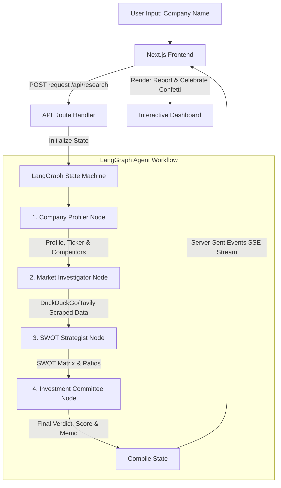

# AegisInvest - Autonomous AI Investment Research Agent

AegisInvest is an autonomous AI agent designed to perform institutional-grade investment research on any global company. Given a company name, the agent executes an agentic workflow to profile the business, scrape recent financial data and market multiples, evaluate market sentiment, build a strategic SWOT analysis, assess critical risk factors, and deliver a formal Investment Committee verdict (`BUY`, `HOLD`, or `PASS`) with a comprehensive reasoning memo.

- **Live Deployment (Vercel)**: [https://ai-investment-research-agent.vercel.app](https://ai-investment-research-agent.vercel.app)
- **GitHub Repository**: [https://github.com/Sumit12312299/AI-Investment-Research-Agent](https://github.com/Sumit12312299/AI-Investment-Research-Agent)

---

## 1. Overview — What It Does

AegisInvest automates the complex, multi-stage workflow of an equity research analyst:
- **Autonomous Profiling**: Identifies the company’s official name, ticker symbol, industry group, core business model, key products, and major competitors.
- **Real-Time Market Search**: Scrapes the web (via Tavily or DuckDuckGo) for real-time financial statements, stock multiples (P/E, P/S, EV/EBITDA, Operating Margins), and recent news headlines.
- **Strategic SWOT Audit**: Synthesizes the qualitative business profile and quantitative financials to construct a Strengths, Weaknesses, Opportunities, and Threats (SWOT) matrix.
- **Risk Logger & Mitigation Planner**: Pinpoints critical regulatory, competitive, macro, or technological risks and prescribes mitigations.
- **Investment Committee Verdict**: Weighs all information to calculate a quantitative Investment Score (0–100), outputs a clear action (`BUY` / `HOLD` / `PASS`), estimates a 12-month target price, and writes a professional multi-paragraph Investment Memo.

---

## 2. How to Run It — Setup & Run Steps

### Prerequisites
- **Node.js**: Version 20.x or 22.x (installed and configured in PATH).
- **NPM**: Version 10.x.

### Installation
1. Extract the project ZIP file.
2. Open a terminal in the root directory `ai-investment/`.
3. Install dependencies:
   ```bash
   npm install --legacy-peer-deps
   ```
   *(Note: `--legacy-peer-deps` is recommended due to peer dependency resolutions between React 19 and third-party libraries).*

### Environment Variables (Optional)
You can configure a `.env.local` file in the root directory to store your API keys globally:
```env
GEMINI_API_KEY=your_gemini_api_key_here
OPENAI_API_KEY=your_openai_api_key_here
TAVILY_API_KEY=your_tavily_api_key_here
```

### Running the App
1. Start the Next.js development server:
   ```bash
   npm run dev
   ```
2. Open your web browser and navigate to **[http://localhost:3000](http://localhost:3000)**.
3. If you did not set the environment variables in `.env.local`, you can input them directly into the **API Credentials** settings panel in the UI. They will be stored securely in your browser's local storage.

---

## 3. How It Works — Approach & Architecture

AegisInvest is built as a unified Next.js App Router application, combining a React frontend with a Node.js backend using LangGraph.js and LangChain.js.

### System Architecture Diagram


### The LangGraph Workflow
The agent under the hood is structured as a 4-node state graph using `@langchain/langgraph`:
1. **Company Profiler Node (`gatherOverview`)**: Queries the LLM to identify the target company's business model, ticker, and core competitors.
2. **Market Investigator Node (`gatherNewsAndFinancials`)**: Performs parallel web searches. It executes queries for current financial statements/multiples and news sentiment, then utilizes the LLM to synthesize this raw text into structured JSON lists.
3. **SWOT Strategist Node (`analyzeSWOT`)**: Combines the profile, financials, and news to identify distinct strategic items across Strengths, Weaknesses, Opportunities, and Threats.
4. **Investment Committee Node (`makeDecision`)**: Acts as the ultimate decision-making body, calculating a conviction score, target price, and a multi-paragraph memo based on the complete dossier.

---

## 4. Key Decisions & Trade-offs

- **Next.js as a Unified Stack**: Instead of separate React and Express servers, we chose Next.js to provide a seamless build, simplified deployment (Vercel-ready), and server-side environment variable security.
- **Server-Sent Events (SSE) Streaming**: We implemented SSE to stream state updates from the backend LangGraph in real-time. This provides an engaging, responsive interface that logs actions *as they execute* instead of waiting for a single long response.
- **Secure Key Storage**: API keys are accepted in the UI settings panel and sent via standard POST headers rather than URL query parameters, protecting them from server logs or browser history leaks.
- **Zero-Key Fallback Search**: If the user does not provide a Tavily API key, the system automatically falls back to an internal DuckDuckGo HTML scraper. This ensures the app is functional out of the box for free.
- **No Tailwind CSS**: Adhering to visual guidelines, we styled the app entirely using Vanilla CSS. This allowed us to construct a highly customized, clean, premium dashboard with harmonized emerald/indigo light accents, avoiding typical "AI look" black aesthetics.

---

## 5. Example Runs

### Example 1: NVIDIA Corporation (Verdict: BUY)
- **Score**: 88/100
- **Target Price**: $145.00
- **Thesis**: NVIDIA commands a near-monopolistic position in the AI hardware space with its CUDA ecosystem acting as a significant moat. While valuation is high, near-term demand matches capacity.
- **SWOT Summary**:
  - *Strength*: CUDA software lock-in, GPU hardware lead.
  - *Weakness*: Supply chain concentration (TSMC dependency).
  - *Opportunity*: Custom enterprise AI chips, edge computing expansion.
  - *Threat*: Hyperscaler in-house silicon development.

### Example 2: Reliance Industries (Verdict: BUY)
- **Score**: 82/100
- **Target Price**: ₹3,350.00
- **Thesis**: Reliance holds a dominant, diversified position across retail, telecom (Jio), and oil-to-chemicals (O2C). It represents a structural proxy for the growth of the Indian consumer economy.
- **SWOT Summary**:
  - *Strength*: Market dominance in retail and telecom, strong cash-generating refinery business.
  - *Weakness*: Heavy capital expenditure cycles leading to debt growth.
  - *Opportunity*: Retail digitization and green energy transition.
  - *Threat*: Changing government regulations, currency fluctuations.

---

## 6. What We Would Improve With More Time

1. **Multi-Agent Deliberation**: Add multiple specialized agents (e.g. a Bull Analyst, a Bear Analyst, and a Macro Analyst) that debate each other in a chat-like loop before the Investment Committee reaches a final decision.
2. **Financial Modelling Engine**: Integrate a tool to fetch complete historical SEC 10-K/10-Q financial statements and build discount cash flow (DCF) models rather than relying on search snippets.
3. **PDF Export**: Add a button to generate and download a beautifully formatted PDF report of the Investment Committee Memo.
4. **Ticker Search Auto-Complete**: Connect to a ticker search API (like Yahoo Finance) to auto-fill tickers and provide real-time stock price charts in the UI.

---

## 7. Development Transcript / Agent Logs (Bonus)

During development, the AI agent assisted in:
- Configuring Next.js project settings and setting up non-interactive boilerplate.
- Resolving React 19/Next.js 16 peer dependencies using legacy resolutions.
- Designing a robust regex-based HTML search scraper for DuckDuckGo.
- Structuring the LangGraph state Annotation schema and Reducer pattern.
- Formulating the CSS layout, custom shadows, and dynamic tab system.
